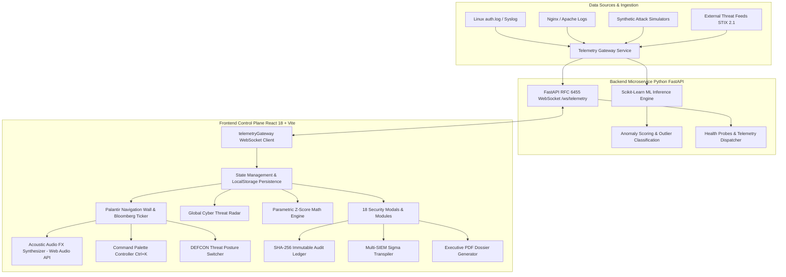

# 🛡️ NexusAI — Autonomous Cybersecurity & ML Anomaly Intelligence Platform

<div align="center">

[](https://reactjs.org/)
[](https://www.typescriptlang.org/)
[](https://vitejs.dev/)
[](https://tailwindcss.com/)
[](https://developer.mozilla.org/en-US/docs/Web/API/Web_Audio_API)
[](https://python.org)
[](https://fastapi.tiangolo.com/)
[](https://www.docker.com/)
[](https://developer.mozilla.org/en-US/docs/Web/API/WebSockets_API)
[](https://oasis-open.github.io/cti-documentation/)
[](https://attack.mitre.org/)
[](https://github.com/atikurrahmanxm/NexusAI)
[](https://opensource.org/licenses/MIT)

<p align="center">
  <strong>Next-Generation SecOps Intelligence, Autonomous Threat Telemetry & Machine Learning Anomaly Detection</strong>
</p>

<p align="center">
  <a href="#-executive-overview">Executive Overview</a> •
  <a href="#-interactive-control-plane--hotkeys">Control Plane & Hotkeys</a> •
  <a href="#-architectural-pillars-18-enterprise-modules">18 Enterprise Modules</a> •
  <a href="#-system-architecture">System Architecture</a> •
  <a href="#-mathematical-foundations">Mathematical Foundations</a> •
  <a href="#-getting-started">Getting Started</a> •
  <a href="#-api--websocket-specification">API Specification</a>
</p>

</div>

---

## 📑 Executive Overview

**NexusAI** is an enterprise-grade SecOps operations and machine learning intelligence platform engineered for modern Security Operations Centers (SOC), Managed Security Service Providers (MSSP), and Enterprise Incident Response teams.

Bridging the gap between raw **Cybersecurity Telemetry**, **High-Throughput Data Streaming**, and **Real-Time Machine Learning**, NexusAI ingests, inspects, and neutralizes multi-vector cyber adversaries in sub-second execution windows. 

Designed following the **Palantir Foundry** and **Bloomberg Terminal** operational philosophy, NexusAI provides security operators with a high-density, multi-pane mission wall, interactive geodetic attack radar, acoustic audio feedback synthesized procedural audio, and an immutable cryptographic audit ledger for complete SOC 2 Type II compliance.

```
┌────────────────────────────────────────────────────────────────────────────────────────┐
│                                NEXUS AI PLATFORM OVERVIEW                              │
├─────────────────────────┬───────────────────────────┬──────────────────────────────────┤
│ 🛰️ Situational Intel    │ 🧠 ML Anomaly Engine      │ ⚡ Automated Containment         │
│ • Geodetic Attack Radar │ • Parametric Z-Score      │ • Sub-Second SOAR Playbooks      │
│ • DEFCON Posture Engine │ • Shannon DGA Entropy     │ • Multi-SIEM Sigma Transpiler    │
│ • Procedural Web Audio  │ • Haversine Travel Speed  │ • Zero-Trust Node Isolation      │
│ • Bloomberg SOC Ticker  │ • Levenshtein Typosquats  │ • Multi-Channel Webhooks         │
└─────────────────────────┴───────────────────────────┴──────────────────────────────────┘
```

---

## ⚡ Interactive Control Plane & Hotkeys

NexusAI features an intuitive, zero-latency operator cockpit designed for high-stress incident mitigation:

| Action / Shortcut | Mechanism | Description |
|:---|:---:|:---|
| **Palantir Command Palette** | <kbd>Ctrl</kbd> + <kbd>K</kbd> / <kbd>Cmd</kbd> + <kbd>K</kbd> | Instant modal search over all 18 security modules, DEFCON posture triggers, attack simulations, and executive reporting. Supports arrow key navigation (<kbd>↑</kbd>/<kbd>↓</kbd>), <kbd>Enter</kbd> to execute, and <kbd>ESC</kbd> to dismiss. |
| **DEFCON Threat Switcher** | Ticker Dropdown | Switch platform posture across **DEFCON 1 (Maximum Alert)** to **DEFCON 5 (Peacetime)**. Generates real-time acoustic alarms and writes cryptographically signed SHA-256 SOC 2 ledger entries. |
| **Acoustic Audio FX** | Top Bar Ticker | Native **Web Audio API** procedural synthesizer. Emits authentic Sonar pings, DEFCON klaxons, AI mitigation chimes, and tactical keyboard clicks. Zero external `.mp3` dependencies; state persists in `localStorage`. |
| **Enterprise Navigator** | Sidebar Input | Instant real-time regex search filtering all 18 security tools by name, category, or compliance badge. |
| **Simulate Attack Vector** | Header Quick-Action | Injects synthetic multi-vector adversary payloads (DDoS, SQLi, Brute-Force, Ransomware C2) into the live telemetry stream. |
| **Export Executive Audit** | Header Quick-Action | Compiles and opens a printable, executive-ready whitepaper PDF audit dossier with cryptographic verification hashes. |

---

## 🏛️ Architectural Pillars (18 Enterprise Modules)

### 1. Situational Awareness & Global Telemetry
- **🌐 Realistic Global Cyber Threat Radar & Attack Map**:
  - Dual-mode projection: **Polar Azimuthal Geodetic Radar** & **Orthographic World Matrix**.
  - Dynamic ballistic laser arc trajectories connecting foreign adversary subnets to protected enterprise nodes.
  - Active intercept counters, target impact telemetry, radar sweep sonar pings, and live country threat leaderboards.
- **📈 Dual-Axis Telemetry & Distribution Wall**:
  - Real-time Recharts time-series stream tracking threat volume alongside parametric anomaly scores.
  - Categorical vector distribution heatmaps, severity meters, and anomaly spike indicators.
- **🛰️ STIX/TAXII 2.1 Threat Intel Hub**:
  - Ingests and correlates external indicators of compromise (IOCs) across CISA KEV, AbuseIPDB, and AlienVault OTX feeds.
  - Live IP reputation analyzer, MITRE ATT&CK Enterprise Matrix navigator, and 1-click STIX 2.1 JSON bundle exporter.

### 2. Machine Learning & Detection Engineering
- **🔬 Detection Engineering Studio & Sigma Compiler**:
  - Open Sigma v2.0 rule authoring environment with abstract syntax tree (AST) telemetry matching.
  - Multi-SIEM transpiler compiling Sigma detection logic into native **Splunk SPL**, **Elasticsearch DSL**, **Microsoft Sentinel KQL**, and **CrowdStrike CQL**.
- **🧠 Statistical Outlier & ML Anomaly Detection**:
  - Real-time parametric Z-score ($Z = \frac{X - \mu}{\sigma}$) and Interquartile Range (IQR) outlier inference.
  - Interactive operator threshold slider ($1.0\sigma$ to $4.0\sigma$) with adaptive baseline recalculation.
- **🤖 Autonomous AI SecOps Copilot**:
  - Contextual threat synthesis engine mapping events directly to MITRE ATT&CK techniques (T1499, T1190, T1110, T1071).
  - One-click autonomous mitigation executing bidirectional firewall enforcement and node isolation.

### 3. Incident Forensics & Root Cause Analysis
- **🧬 Cyber Kill-Chain Root Cause Analysis (RCA) Graph**:
  - Interactive multi-stage timeline reconstruction covering *Reconnaissance*, *Weaponization*, *Exploitation*, *Lateral Movement*, and *Exfiltration*.
  - Blast-radius perimeter calculation and cryptographic SHA-256 evidence vault holding PCAP captures, memory dumps, and process lineage graphs.
- **🔎 Forensic Deep Packet Investigation**:
  - High-density telemetry explorer with full-text search, multi-column sorting, severity badges, and CSV audit export.
- **📥 Real-World Dataset & Log Ingestion Studio**:
  - Multi-format ingestion parser supporting raw Linux `auth.log`, Nginx access logs, Apache error logs, and RFC 5424 Syslog payloads with curated scenario presets.

### 4. Identity, API & Supply Chain Defense
- **👤 Identity Threat Detection & Response (ITDR)**:
  - Mathematical **Haversine Geovelocity** impossible travel detector flagging concurrent logins exceeding commercial flight limits (> 900 km/h).
  - MFA push-bombing fatigue defense and one-click revocation of compromised IAM sessions.
- **🛡️ API Security Shield & OWASP API Top 10 Guard (WAAP)**:
  - Continuous discovery of Shadow and Zombie API endpoints.
  - Real-time BOLA/IDOR object-level authorization validation, JWT cryptographic signature inspection (`alg: none` exploit hunter), and Cloudflare API Shield policy generation.
- **📦 Software Supply Chain Security & SBOM Intelligence**:
  - **CycloneDX 1.5** & **SPDX 2.3** certified dependency graph auditor.
  - Mathematical **Levenshtein Distance** algorithm detecting typosquatting and homoglyph attacks in npm/PyPI registries, upstream XZ-style backdoor detection, and copyleft license compliance enforcement.

### 5. Cloud Governance, SOAR & Zero-Trust Mesh
- **☁️ Cloud Security Posture Management (CSPM)**:
  - Multi-cloud configuration auditor covering AWS, GCP, Azure, and Kubernetes.
  - Automated compliance cross-walk against **CIS Benchmarks v8**, **PCI-DSS 4.0**, **SOC 2 Type II**, and **ISO/IEC 27001**, with auto-generated Terraform HCL remediation blocks.
- **⚡ SOAR Autonomous Playbook Engine**:
  - Pre-orchestrated sub-second response pipelines for DDoS mitigation, SQLi sanitization, and Ransomware C2 containment (mean time to respond: 1.2s vs. 45m manual).
- **🖥️ Central Server Fleet & Zero-Trust Mesh**:
  - Multi-cloud node registry with real-time CPU, RAM, and network bandwidth meters.
  - One-click Zero-Trust node quarantine to immediately sever compromised instances from the internal VPC mesh.
- **🎯 Threat Hunting Studio & Deception Honeypot Grid**:
  - Deep adversary fingerprinting with BGP ASN, ISP, and city geolocations.
  - Synthetic honeypots (SSH, WordPress, AWS Honeytoken, MySQL) and automated RFC 2142 ISP abuse notice generation.
- **🔐 Role-Based Access Control (RBAC) & Immutable Audit Ledger**:
  - Four clearance tiers: `COMMANDER (Level 4)`, `ANALYST (Level 3)`, `AUDITOR (Level 2)`, `DEVOPS (Level 2)`.
  - Cryptographically chained SHA-256 tamper-evident ledger tracking every operator action for SOC 2 Type II compliance.
- **🛡️ Vulnerability Management & CVE Patch Engine**:
  - Fleet-wide host package scanning with CVSS v3.1 severity scores and CISA Known Exploited Vulnerabilities (KEV) catalog correlation.
- **🔔 Multi-Channel Alert Webhooks**:
  - Instant dispatch to Slack (`#secops-alerts`), Discord, Telegram bots, PagerDuty, and custom enterprise SIEM endpoints with sub-50ms latency.
- **📑 Executive Threat Intelligence Audit Dossier**:
  - Printable, publication-ready PDF audit reports featuring compliance matrices, threat summary KPIs, and cryptographic digital sign-offs.

---

## 📐 System Architecture



---

## 🧮 Mathematical Foundations

NexusAI utilizes formal statistical and mathematical models for deterministic, explainable security analytics:

### 1. Parametric Z-Score Anomaly Formulation
Identifies volumetric metric deviations from normal system baseline:
$$Z = \frac{X - \mu}{\sigma}$$
*Where:*
- $X$ = Current observed telemetry metric (requests/sec, latency, failed authentications)
- $\mu$ = Rolling baseline arithmetic mean: $\mu = \frac{1}{N}\sum_{i=1}^{N} X_i$
- $\sigma$ = Standard deviation: $\sigma = \sqrt{\frac{1}{N}\sum_{i=1}^{N}(X_i - \mu)^2}$
- An anomaly flag is triggered whenever $|Z| \ge \tau$ (configurable sensitivity threshold $\tau \in [1.0, 4.0]$).

### 2. Shannon Entropy DGA & Exfiltration Classifier
Calculates the degree of randomness in DNS query hostnames to detect Algorithmically Generated Domains (DGA) and Base64-encoded DNS tunneling:
$$H(X) = -\sum_{i=1}^{n} P(x_i) \log_2 P(x_i)$$
*Domains with $H(X) > 3.85$ are automatically quarantined as high-confidence DGA C2 beacons.*

### 3. Haversine Impossible Travel Geovelocity
Calculates the great-circle spherical distance between two sequential authentication events on Earth:
$$d = 2R \arcsin \left( \sqrt{\sin^2\left(\frac{\Delta\phi}{2}\right) + \cos(\phi_1)\cos(\phi_2)\sin^2\left(\frac{\Delta\lambda}{2}\right)} \right)$$
$$v = \frac{d}{\Delta t}$$
*Where $R = 6,371\text{ km}$. If calculated velocity $v > 900\text{ km/h}$, an ITDR impossible travel incident is triggered immediately.*

### 4. Levenshtein Distance Supply Chain Hunter
Measures the minimum single-character edit operations (insertions, deletions, substitutions) between package names to prevent typosquatting attacks:
$$D[i,j] = \begin{cases} \max(i, j) & \text{if } \min(i,j) = 0, \\ \min \begin{cases} D[i-1,j] + 1 \\ D[i,j-1] + 1 \\ D[i-1,j-1] + 1_{(s_1[i] \neq s_2[j])} \end{cases} & \text{otherwise.} \end{cases}$$
*Flags packages where $1 \le D(s_{\text{candidate}}, s_{\text{popular}}) \le 2$.*

### 5. Cryptographic SHA-256 Tamper-Evident Hash Chain
Every RBAC operation and DEFCON posture change generates an immutable cryptographic block:
$$H_k = \text{SHA-256}(H_{k-1} \parallel \text{Timestamp} \parallel \text{OperatorID} \parallel \text{Action} \parallel \text{Resource})$$
*Guarantees zero-tamper audit validity for SOC 2 Type II and ISO 27001 certifications.*

---

## 📂 Repository Directory Layout

```
NexusAI/
├── public/                       # Static public web assets and SVG icons
│   ├── favicon.svg               # NexusAI platform favicon
│   ├── icons.svg                 # SVG sprite sheet
│   └── shield.svg                # Brand vector badge
├── src/                          # TypeScript React 18 Application Source
│   ├── components/               # 18 Enterprise SecOps Modals & UI Views
│   │   ├── ApiSecurityModal.tsx          # OWASP API Top 10 Guard & WAAP
│   │   ├── ChaosLabModal.tsx             # Chaos Engineering & Attack Simulator
│   │   ├── CommandPaletteModal.tsx       # Palantir Ctrl+K Command Palette
│   │   ├── CspmModal.tsx                 # Cloud Security Posture Management
│   │   ├── DetectionStudioModal.tsx      # Sigma Multi-SIEM Transpiler
│   │   ├── DnsThreatIntelModal.tsx       # EASM & Shannon Entropy DGA
│   │   ├── ExecutiveReportModal.tsx      # Printable Executive PDF Dossier
│   │   ├── GlobalThreatMap.tsx           # Geodetic Threat Radar & Attack Map
│   │   ├── ItdrModal.tsx                 # Identity Threat Detection & Response
│   │   ├── LogIngestModal.tsx            # Multi-Format Log Ingestion Studio
│   │   ├── PolicyExportModal.tsx         # Firewall Policy Compiler (iptables/UFW/WAF)
│   │   ├── RbacAuditModal.tsx            # Cryptographic RBAC & Audit Ledger
│   │   ├── RcaForensicsModal.tsx         # Cyber Kill-Chain Root Cause Analysis
│   │   ├── ServerFleetModal.tsx          # Zero-Trust Server Mesh & Quarantine
│   │   ├── SoarPlaybookModal.tsx         # Automated Incident Response Playbooks
│   │   ├── StixThreatIntelModal.tsx      # STIX/TAXII 2.1 Intel & MITRE Matrix
│   │   ├── SupplyChainModal.tsx          # CycloneDX 1.5 SBOM & Typosquatting
│   │   ├── ThreatHuntModal.tsx           # Deception Honeypots & RFC 2142 Abuse
│   │   ├── VulnerabilityModal.tsx        # CVE Scanner & CVSS v3.1 Patching
│   │   └── WebhookAlertModal.tsx         # Multi-Channel Alert Dispatcher
│   ├── services/                 # Core Business Logic & Telemetry Engines
│   │   ├── apiBridge.ts                  # FastAPI REST & Health Probe Client
│   │   ├── audioFxEngine.ts              # Web Audio API Procedural Synthesizer
│   │   ├── detectionStudioEngine.ts      # Sigma AST Multi-SIEM Compiler
│   │   ├── dnsIntelEngine.ts             # Shannon Entropy & DGA Math Engine
│   │   ├── itdrEngine.ts                 # Haversine Geovelocity Calculator
│   │   ├── rcaForensicsEngine.ts         # Kill-Chain Sequencer & Evidence Vault
│   │   ├── supplyChainEngine.ts          # Levenshtein Typosquatting Algorithm
│   │   ├── telemetryEngine.ts            # Parametric Z-Score Outlier Engine
│   │   └── websocketService.ts           # RFC 6455 WebSocket Stream Gateway
│   ├── types/                    # Enterprise Domain Type Definitions
│   │   ├── apiSecurity.ts                # OWASP API & JWT Schema Definitions
│   │   ├── detectionStudio.ts            # Sigma Rules & SIEM Target Types
│   │   ├── dnsIntel.ts                   # EASM & Shannon Entropy Structures
│   │   ├── itdr.ts                       # Identity Threat & GeoIP Types
│   │   ├── rbacAudit.ts                  # Audit Ledger & Clearance Roles
│   │   ├── rcaForensics.ts               # Kill-Chain Stages & Evidence Schemas
│   │   ├── supplyChain.ts                # CycloneDX 1.5 SBOM Schemas
│   │   └── telemetry.ts                  # Security Event & Time-Series Types
│   ├── App.tsx                   # Design #5 Palantir Cockpit Container
│   ├── index.css                 # Tailwind CSS 3.4 & Cyberpunk Glassmorphism
│   └── main.tsx                  # React 18 DOM Entrypoint
├── backend/                      # Python 3.10 FastAPI Microservice
│   ├── main.py                   # REST API & WebSocket Server
│   ├── requirements.txt          # Python Dependencies (FastAPI, Scikit-learn, etc.)
│   └── Dockerfile                # Backend Multi-Stage Container Spec
├── docker-compose.yml            # Full-Stack Multi-Container Orchestration
├── nginx.conf                    # Production Reverse Proxy & WebSocket Upstream
├── Dockerfile                    # Production Frontend Container Build
├── package.json                  # NPM Project Spec & Scripts
├── tsconfig.json                 # TypeScript Strict Mode Compiler Configuration
└── vite.config.ts                # Vite 6.4 Build & Plugin Pipeline
```

---

## 🚀 Getting Started

### Prerequisites
- **Node.js**: `v18.0.0` or higher
- **NPM**: `v9.0.0` or higher
- **Python**: `v3.10` or higher (optional, for backend ML microservice)
- **Docker & Docker Compose**: (optional, for containerized deployment)

---

### Option A: Run via Docker Compose (Recommended for Production)

Launch both the **React Frontend** (behind high-performance Nginx) and the **Python FastAPI Backend** with a single command:

```bash
# 1. Clone the repository
git clone https://github.com/atikurrahmanxm/NexusAI.git
cd NexusAI

# 2. Build and launch all services in detached mode
docker compose up -d --build

# 3. Verify running containers
docker compose ps
```

- **Frontend Dashboard**: Open [http://localhost:3000](http://localhost:3000)
- **FastAPI Documentation**: Open [http://localhost:8000/docs](http://localhost:8000/docs)
- **WebSocket Gateway**: `ws://localhost:8000/ws/telemetry`

To stop the containers:
```bash
docker compose down
```

---

### Option B: Local Bare-Metal Development

#### 1. Frontend Setup (React 18 + Vite)
```bash
# Install frontend dependencies
npm install

# Start Vite hot-reloading development server
npm run dev
```
The application will launch at `http://localhost:5173`.

#### 2. Backend Setup (Python 3.10 + FastAPI)
In a separate terminal window:
```bash
# Navigate to backend directory
cd backend

# Create virtual environment (optional but recommended)
python -m venv venv
source venv/bin/activate  # On Windows: .\venv\Scripts\activate

# Install dependencies
pip install -r requirements.txt

# Start FastAPI server with Uvicorn
python main.py
```
The backend API server will run at `http://127.0.0.1:8000`.

#### 3. Production Build & Verification
To verify TypeScript compilation and generate the optimized production bundle:
```bash
npm run build
```
This runs `tsc && vite build`, creating a minified, tree-shaken distribution in `./dist`.

---

## 🔌 API & WebSocket Specification

### 1. REST Endpoints

| Method | Endpoint | Description | Sample Response |
|:---:|:---|:---|:---|
| `GET` | `/api/health` | Backend health, ML engine status & latency | `{"status":"online","engine":"Scikit-Learn IsolationForest","timestamp":"..."}` |
| `POST` | `/api/telemetry/predict` | Run ML anomaly inference on batch event vector | `{"anomaly_score":8.4,"is_outlier":true,"classification":"DDoS_SYN_FLOOD"}` |
| `POST` | `/api/policy/compile` | Compile blocklist into firewall syntax | `{"syntax":"iptables","rules":["iptables -A INPUT -s 198.51.100.42 -j DROP"]}` |

### 2. WebSocket Telemetry Stream (`RFC 6455`)

- **URI**: `ws://127.0.0.1:8000/ws/telemetry`
- **Protocol**: Real-time bi-directional JSON streaming.
- **Client Frame Structure**:
```json
{
  "id": "evt-1790600000",
  "timestamp": "14:28:10",
  "sourceIp": "198.51.100.42",
  "destinationIp": "10.0.4.15",
  "attackType": "DDoS SYN Flood",
  "severity": "critical",
  "anomalyScore": 9.4,
  "status": "blocked",
  "geo": {
    "country": "Germany",
    "city": "Frankfurt",
    "lat": 50.1109,
    "lng": 8.6821
  }
}
```

*Note: If the Python backend is offline, NexusAI's in-browser **Hybrid ML Runtime** seamlessly handles telemetry generation and inference with zero user interruption.*

---

## 🛡️ Compliance & Framework Alignment

| Framework | Target Version | Platform Capability |
|:---|:---:|:---|
| **MITRE ATT&CK** | Enterprise v14 | Direct matrix mapping for Initial Access (TA0001), Execution (TA0002), Credential Access (TA0006), and Exfiltration (TA0010). |
| **CIS Benchmarks** | v8 Controls | Automated CSPM validation across AWS, GCP, Azure, and Kubernetes configurations. |
| **SOC 2 Type II** | Trust Services Criteria | Chained SHA-256 tamper-evident RBAC audit ledger and printable Executive Audit Dossier. |
| **NIST SP 800-161** | Supply Chain Risk | CycloneDX 1.5 / SPDX 2.3 SBOM auditing with Levenshtein typosquatting detection. |
| **OWASP API Security** | Top 10 2023 | Shadow API route discovery, BOLA/IDOR authorization verification, and JWT algorithm validation. |

---

## 🤝 Contributing

Contributions from cybersecurity professionals, data scientists, and full-stack developers are welcome!

1. Fork the Project repository.
2. Create your Feature Branch:
   ```bash
   git checkout -b feat/amazing-threat-hunter
   ```
3. Commit your changes:
   ```bash
   git commit -m "feat(hunting): add advanced memory dump heuristics"
   ```
4. Push to the Branch:
   ```bash
   git push origin feat/amazing-threat-hunter
   ```
5. Open a Pull Request.

---

## 📜 License

Distributed under the **MIT License**. See `LICENSE` for more information.

Developed with precision by **[Atikur Rahman](https://github.com/atikurrahmanxm)**.
